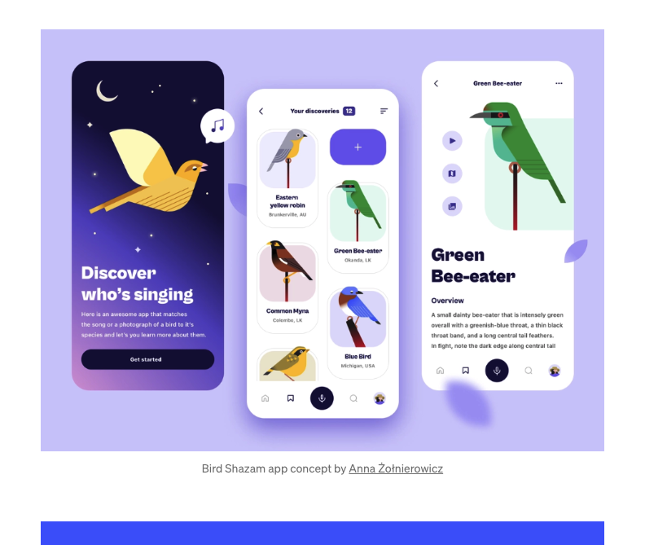
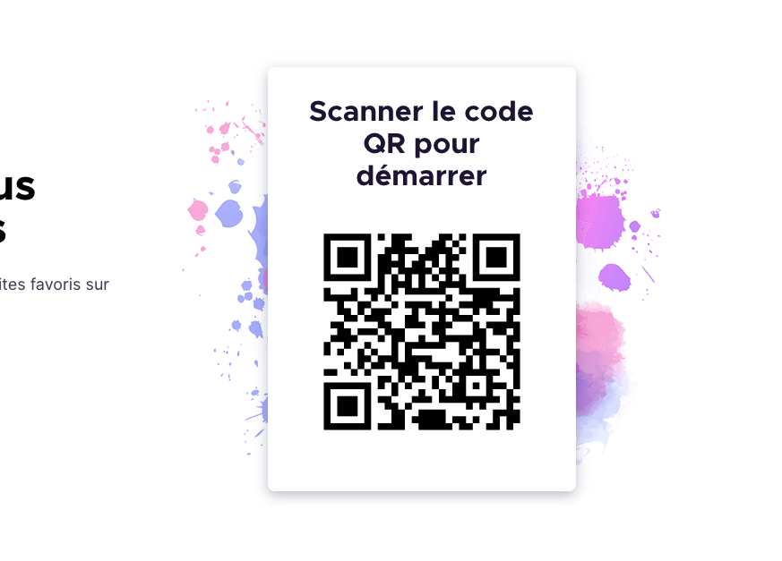
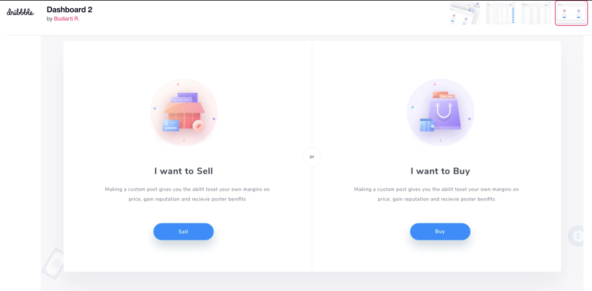
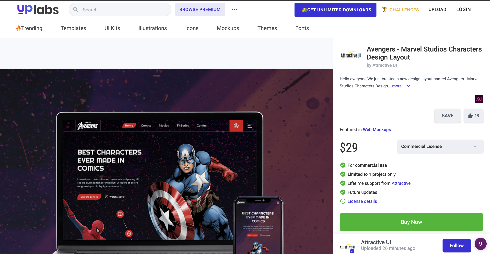
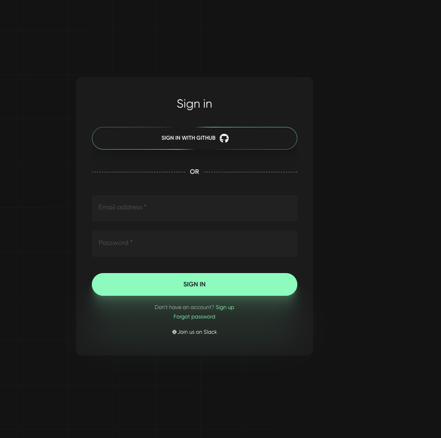
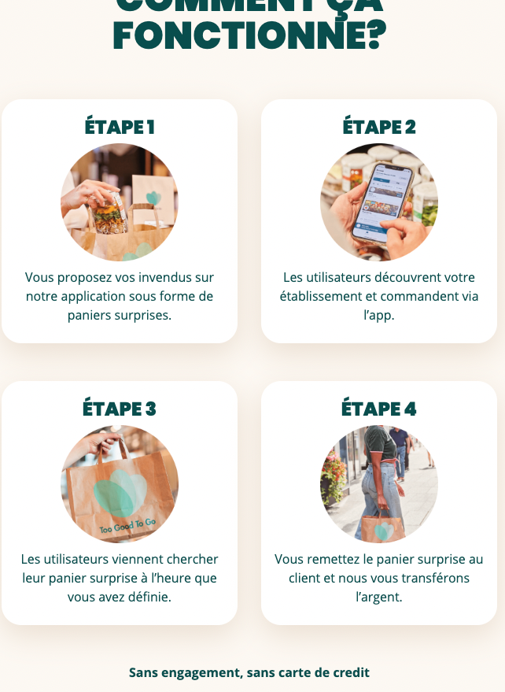

# PFE

## Présentation

Projet en ligne : http://159.223.232.46/ 
Moodboard InVision : https://projects.invisionapp.com/boards/7943QT2QWN8/
Wireframe : https://xd.adobe.com/view/641c2327-49e4-4799-827d-9503459d66b8-314f/
Design 1 (je teste plusieurs visuels) : https://xd.adobe.com/view/9d76516f-1c3e-4461-87e3-a38ef099854e-c825/ 
Design 2 (Je développe le design choisi) : https://xd.adobe.com/view/79f71ce1-1ae7-4905-a22f-e8b044d84d2a-2ca4/

Pour mon PFE, j'ai décidé de faire un site web pour mon père, Tayfun AKDEDE (indépendant) qui s'est lancé dans la vente en lot de boissons et de snacks.

Nom du market : Top Soda

La vente de ses produits se fait par téléphone (appel, sms, WhatsApp, Facebook). Il fait donc lui même la livraison de ses commandes (lieu:  Ans, Awans, Bassenge, Beyne-Heusay, Blegny, Chaudfontaine, Dalhem, Flémalle, Fléron, Grâce-Hollogne, Herstal, Juprelle, Liège, Oupeye, Saint-Nicolas, Seraing, Soumagne, Trooz, Visé).

Les paiements sont souvent effectués en espèces, via Bancontact ou encore Paypal.

Pour la gestion de ses ventes, il utilise un `tableau excel` et pour la liste des produits c'est un `tableau word` converti en `PDF` qu'il envoie à ses clients.

A chaque changement (changement de prix, nouveauté, etc) le PDF est réenvoyé.

### Avantages d'avoir un site web
- gain de temps pour le vendeurn tout changement se fait que sur le site
- mettre à jour ses prix rapidement
- gain de temps pour le client qui n'aura pas à demander le PDF à chaque fois
- user-friendly et attractif pour le client car il aura un visuel de ce qu'il veut et non pas uniquement un tableau pdf

## Cahier des charges

- Site web accessible sur Mobile et sur Ordinateur
- Pas de Wordpress
- Facile d‘utilisation
- Interface claire et compréhesible
- Pas e-shop
- Coordonnées de contact mise en avant (facebook, tel, etc)
- Search bar
- **Clients** :
    - Constitué une wishlist qui sera envoyé au vendeur et/ou enregistré en PDF
- **Admin** :
    - Ajouter produits (Nom, description, photo, prix, catégories)
    - Supprimer produits
    - Produit "en rupture de stock" / "bientôt disponible"
    - Produits "Stock limité" avec un timing countdown
    - Modifier produits (prix, images, descriptions)
    - Ajouter catégories (snack, boissons énergisantes, boissons pétillantes, eau, café...)
    - Avoir la liste des boissons sous forme de tableau
    - Produit éditable disrectement sur la page d'un single-produit si authentifié

## Page & fonctionnalité

- **Accueil**
    - Slider : phrase catch ou produits mis en avant (eg: nouveauté)
    - lister quelques boissons
    - cta pour voir toutes les boissons
    - lister quelques snack
    - cta pour voir tous les snacks
- **Header**
    - burger menu / menu desktop
    - logo
    - loupe pour recherche en desktop / barre rechercha dans aside menu en mobile
- **Footer**
    - quelques liens de navigation (menu) dans le footer
    - copyright
    - mentions légales
    - politiques de confidentialités
    - politiques des cookies
    - logo
    - adresse
    - numero de tel
    - email
- **Boissons / Snacks**
    - CTA de tri
    - tag cliquable pour sélectionner les catégories de boissons / snacks
- **Contact**
    - Formulaire de contact
    - facebook
    - whatspapp
    - num tel
- **À propos**
- **Résultat de recherche**
    - Lister les résultats avec paginations
    - Banner pour renvoyer vers toutes les boissons / tous les snack
- **404**
    - Page not found
    - Barre de recherche mise en avant
- **Politiques des cookies**
- **Mentions légales**
- **Politiques de confidentialités**
- **Admin**
    - Route privée - pas de lien direct seul l'admin aura le lien type wordpress /wp-admin
    - Se connecter / Se déconnecter
    - Ajouter bouton pour accéder coté admin dans menu si connecté
    - Modifier Slider accueil
    - Ajouter/Édit/Delete boissons & snack
    - Ajouter catégorie
    - Ajouter sous-catégorie
    - Ajouter Marques
    - Voir liste des boissons snack directement en dur
    - Liste des ventes
    - Encoder vente (Client info, date, produit)
- **Guest**
    - ajouter à la Wishlist
    - Envoyer la wishlist au vendeur (db et mail)
    - Enregistrer en PDF

### Jeter un oeil à ces sites :
- https://www.monsterenergy.com/be/fr/products/monster-energy
- https://www.capri-sun.com/fr/fruit-crush-tropical/
- https://www.redbull.com/be-fr/energydrink/red-bull-yellow-edition
- https://www.kinder.com/be/fr/kinder-surprise
- https://www.simoneasoif.be/
- https://www.belgiancraftdrinks.be/
- https://toogoodtogo.be/fr-be/business

## Inspiration URL to keep
- https://zulu.longines.com/
- https://www.uplabs.com/posts/creative-agency-react-nextjs-template
- https://www.uplabs.com/posts/rundle-bike-landing-page-design
- https://en.yfood.eu/
- 

## Design

[Lien vers mon Moodboard sur Dribbble](https://dribbble.com/maiakd/collections/5696437-pfe?utm_source=Clipboard_%22clipboard_collection%22&utm_campaign=%22maiakd%22&utm_content=%22pfe%22&utm_medium=Social_Share)

### Inspirations

### Searchable MultiSlect Dropdown 
- https://codepen.io/LoneFox/pen/OJVjPeg
- https://codepen.io/vdhug/pen/xxbPoJe
- https://www.itsolutionstuff.com/post/laravel-multi-select-dropdown-with-checkbox-exampleexample.html

### Couleur 

- https://colourcontrast.cc/087985/ffffff

### Police
TODO: à déterminer

### Artciles liés aux soucis rencontré:

- https://www.bounteous.com/insights/2019/03/22/orange-you-accessible-mini-case-study-color-ratio/
- https://graphicdesign.stackexchange.com/questions/81360/why-is-the-w3c-contrast-score-recommending-hard-to-read-text
- https://uxmovement.com/buttons/the-myths-of-color-contrast-accessibility/
- 
***

## About Laravel

Laravel is a web application framework with expressive, elegant syntax. We believe development must be an enjoyable and creative experience to be truly fulfilling. Laravel takes the pain out of development by easing common tasks used in many web projects, such as:

- [Simple, fast routing engine](https://laravel.com/docs/routing).
- [Powerful dependency injection container](https://laravel.com/docs/container).
- Multiple back-ends for [session](https://laravel.com/docs/session) and [cache](https://laravel.com/docs/cache) storage.
- Expressive, intuitive [database ORM](https://laravel.com/docs/eloquent).
- Database agnostic [schema migrations](https://laravel.com/docs/migrations).
- [Robust background job processing](https://laravel.com/docs/queues).
- [Real-time event broadcasting](https://laravel.com/docs/broadcasting).

Laravel is accessible, powerful, and provides tools required for large, robust applications.

## Learning Laravel

Laravel has the most extensive and thorough [documentation](https://laravel.com/docs) and video tutorial library of all modern web application frameworks, making it a breeze to get started with the framework.

If you don't feel like reading, [Laracasts](https://laracasts.com) can help. Laracasts contains over 2000 video tutorials on a range of topics including Laravel, modern PHP, unit testing, and JavaScript. Boost your skills by digging into our comprehensive video library.

## Laravel Sponsors

We would like to extend our thanks to the following sponsors for funding Laravel development. If you are interested in becoming a sponsor, please visit the Laravel [Patreon page](https://patreon.com/taylorotwell).

### Premium Partners

- **[Vehikl](https://vehikl.com/)**
- **[Tighten Co.](https://tighten.co)**
- **[Kirschbaum Development Group](https://kirschbaumdevelopment.com)**
- **[64 Robots](https://64robots.com)**
- **[Cubet Techno Labs](https://cubettech.com)**
- **[Cyber-Duck](https://cyber-duck.co.uk)**
- **[Many](https://www.many.co.uk)**
- **[Webdock, Fast VPS Hosting](https://www.webdock.io/en)**
- **[DevSquad](https://devsquad.com)**
- **[Curotec](https://www.curotec.com/services/technologies/laravel/)**
- **[OP.GG](https://op.gg)**
- **[WebReinvent](https://webreinvent.com/?utm_source=laravel&utm_medium=github&utm_campaign=patreon-sponsors)**
- **[Lendio](https://lendio.com)**

## Contributing

Thank you for considering contributing to the Laravel framework! The contribution guide can be found in the [Laravel documentation](https://laravel.com/docs/contributions).

## Code of Conduct

In order to ensure that the Laravel community is welcoming to all, please review and abide by the [Code of Conduct](https://laravel.com/docs/contributions#code-of-conduct).

## Security Vulnerabilities

If you discover a security vulnerability within Laravel, please send an e-mail to Taylor Otwell via [taylor@laravel.com](mailto:taylor@laravel.com). All security vulnerabilities will be promptly addressed.

## License

The Laravel framework is open-sourced software licensed under the [MIT license](https://opensource.org/licenses/MIT).

***

## About Laravel

Laravel is a web application framework with expressive, elegant syntax. We believe development must be an enjoyable and creative experience to be truly fulfilling. Laravel takes the pain out of development by easing common tasks used in many web projects, such as:

- [Simple, fast routing engine](https://laravel.com/docs/routing).
- [Powerful dependency injection container](https://laravel.com/docs/container).
- Multiple back-ends for [session](https://laravel.com/docs/session) and [cache](https://laravel.com/docs/cache) storage.
- Expressive, intuitive [database ORM](https://laravel.com/docs/eloquent).
- Database agnostic [schema migrations](https://laravel.com/docs/migrations).
- [Robust background job processing](https://laravel.com/docs/queues).
- [Real-time event broadcasting](https://laravel.com/docs/broadcasting).

Laravel is accessible, powerful, and provides tools required for large, robust applications.

## Learning Laravel

Laravel has the most extensive and thorough [documentation](https://laravel.com/docs) and video tutorial library of all modern web application frameworks, making it a breeze to get started with the framework.

If you don't feel like reading, [Laracasts](https://laracasts.com) can help. Laracasts contains over 2000 video tutorials on a range of topics including Laravel, modern PHP, unit testing, and JavaScript. Boost your skills by digging into our comprehensive video library.

## Laravel Sponsors

We would like to extend our thanks to the following sponsors for funding Laravel development. If you are interested in becoming a sponsor, please visit the Laravel [Patreon page](https://patreon.com/taylorotwell).

### Premium Partners

- **[Vehikl](https://vehikl.com/)**
- **[Tighten Co.](https://tighten.co)**
- **[Kirschbaum Development Group](https://kirschbaumdevelopment.com)**
- **[64 Robots](https://64robots.com)**
- **[Cubet Techno Labs](https://cubettech.com)**
- **[Cyber-Duck](https://cyber-duck.co.uk)**
- **[Many](https://www.many.co.uk)**
- **[Webdock, Fast VPS Hosting](https://www.webdock.io/en)**
- **[DevSquad](https://devsquad.com)**
- **[Curotec](https://www.curotec.com/services/technologies/laravel/)**
- **[OP.GG](https://op.gg)**
- **[WebReinvent](https://webreinvent.com/?utm_source=laravel&utm_medium=github&utm_campaign=patreon-sponsors)**
- **[Lendio](https://lendio.com)**

## Contributing

Thank you for considering contributing to the Laravel framework! The contribution guide can be found in the [Laravel documentation](https://laravel.com/docs/contributions).

## Code of Conduct

In order to ensure that the Laravel community is welcoming to all, please review and abide by the [Code of Conduct](https://laravel.com/docs/contributions#code-of-conduct).

## Security Vulnerabilities

If you discover a security vulnerability within Laravel, please send an e-mail to Taylor Otwell via [taylor@laravel.com](mailto:taylor@laravel.com). All security vulnerabilities will be promptly addressed.

## License

The Laravel framework is open-sourced software licensed under the [MIT license](https://opensource.org/licenses/MIT).
